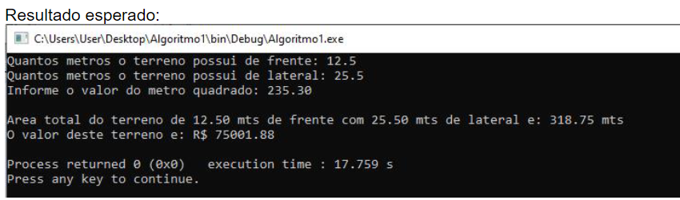

# Teste seus algoritmos com os mesmos valores do exemplo e compare os resultados

1. Uma imobiliária vende apenas terrenos retangulares. Faça um algoritmo para imprimir a
   área do terreno e o valor de venda do mesmo. Para isto será necessário o usuário
   informar as dimensões em metros (frente e lateral) do terreno além do valor cobrado pelo
   metro quadrado.

