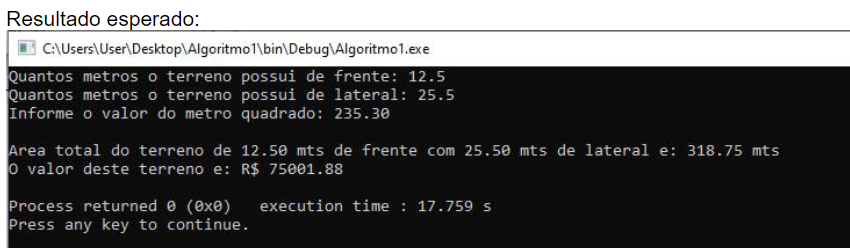

# :bulb: Teste seus algoritmos com os mesmos valores do exemplo e compare os resultados :bulb:

:pushpin: 1. Uma imobiliária vende apenas terrenos retangulares. Faça um algoritmo para imprimir a
   área do terreno e o valor de venda do mesmo. Para isto será necessário o usuário
   informar as dimensões em metros (frente e lateral) do terreno além do valor cobrado pelo
   metro quadrado.

:pushpin: 2. Faça um algoritmo que receba o valor do salário mínimo e o valor do salário de um
   funcionário, calcule e mostre a quantidade de salários mínimos que ganha esse
   funcionário.

:pushpin: 3. Faça um algoritmo para ler três notas de um aluno em uma disciplina e imprimir a sua
   média ponderada (as notas tem pesos respectivos de 1, 2 e 3).

:pushpin: 4. Faça um algoritmo que calcule e mostre a tabuada de (+, -, * e /) de um número
   digitado pelo usuário.

   - OBS: Quando se calcula em uma substração um numero menor de um número maior (ex:
   3 - 10) o resultado será um número negativo. Pesquise como desprezar o sinal negatio
   para sempre termos um número positivo

   Resultado esperado:

:pushpin: 5. Faça um algoritmo que receba dois números inteiros, calcule e mostre a divisão do
   primeiro número pelo segundo. Sabe-se que o segundo número não pode ser zero,
   portanto não é necessário se preocupar com validações.
   
   - OBS: Para forçar uma divisão de dois números inteiro produzir um resultado fracionário,
   utilizamos a palavra float entre parênteses. Exemplo: (a/(float)b). Neste caso, forçamos o
   compilador entender que a variavel b apesar de ser inteira deve ser convertida para float

   Resultado esperado:

:pushpin: 6. Faça um algoritmo para calcular quantas ferraduras são necessárias para equipar
   todos os cavalos comprados para um haras. O usuário devera informar a quantidade de
   cavalos adquiridos.

:pushpin: 7. Faça um algoritmo que receba o peso de uma pessoa, calcule e mostre:

      a) o novo peso se a pessoa engordar 15% sobre o peso digitado;

      b) o novo peso se a pessoa emagrecer 20% sobre o peso digitado.

:pushpin: 8. Faça um algoritmo para ler o salário de um funcionário e aumentá-Io em 15%. Após o
aumento, desconte 11% de INSS e 8% de FGTS. Imprima o salário inicial, o salário com o
aumento, o salário final, o desconto do INSS, o desconto do FGTS e o Total de Descontos
(INSS+FGTS).

:pushpin: 09. Faça um algoritmo que leia os dados necessários para calcular e exibir a área:
Pesquisa na Internet como calculcar a área de cada objeto abaixo:

      a) de um trapézio.

      b) de um quadrado.

      c) de um retangulo.

      d) de um círculo.

      e) de um triangulo.

:pushpin: 10. Faça um algoritmo que receba o ano de nascimento de uma pessoa e o ano atual,
calcule e mostre.

      a) a idade dessa pessoa em anos;

      b) a idade dessa pessoa em meses;

      c) a idade dessa pessoa em dias; considere todos os meses com 30 dias

      d) a idade dessa pessoa em semanas, considere que todos os messes possuem 4
      semanas;

Resultado esperado:

:pushpin: 11. Um tonel de refresco é feito com 8 partes de água mineral e 2 partes de suco de
    maracujá. Faça um algoritmo para calcular quantos litros de água e de suco são
    necessários para se fazer uma certa quantidade de litros de refresco informados pelo
    usuário.

:pushpin: 12. A granja Frangotech possui um controle automatizado de cada frango da sua
    produção. No pé direito do frango há um anel com um chip de identificação; no pé
    esquerdo são dois anéis para indicar o tipo de alimento que ele deve consumir. Sabendo
    que o anel com chip custa R$4,00 e o anel de alimento custa R$3,50, faça um algoritmo
    para calcular o gasto total da granja para marcar todos os seus frangos que deverá ser
    informado pelo usuário.

:pushpin: 13. A fábrica de refrigerantes Meia-Cola vende seu produto em três formatos: lata de 350
    ml, garrafa de 600 ml e garrafa de 2 litros. Se um comerciante compra uma determinada
    quantidade de cada formato, faça um algoritmo para calcular quantos litros de refrigerante
    ele comprou

:pushpin: 14. A lanchonete Gostosura vende apenas um tipo de sanduíche, cujo recheio inclui duas
    fatias de queijo, uma fatia de presunto e uma rodela de hambúrguer. Sabendo que cada
    fatia de queijo ou presunto pesa 50 gramas, e que a rodela de hambúrguer pesa 120
    gramas, faça um algoritmo em que o dono forneça a quantidade de sanduíches a fazer, e
    a máquina informe as quantidades (em quilos) de queijo, presunto e carne necessários
    para compra

:pushpin: 15. A empresa Hipotheticus paga R$10,00 por hora normal trabalhada, R$15,00 por hora
extra e R$ 90 reais por cada dependente menor que 6 anos. Faça um algoritmo que
solicite a quantidade de horas normais e extras trabalhadas no mês além da quantidade
de dependentes menores que 6 anos. Considere que o salário líquido é igual ao salário de
horas normais descontando-se 11% de impostos. O salário final é o salário liquido mais o
valor recebido por cada dependente mais as horas extras.

:pushpin: 16. Uma loja de decoração precisa aumentar o seu faturamento para o próximo mês em
    20%. Esta loja deseja atingir este objetivo aumentando a venda de três produtos. O
    produto 1 custa R$ 150 o produto 2 R$ 220,00 e o produto 3 R$ 97.00. Faça um algoritmo
    que receba o valor de faturamento do último mês e apresente:

    a) O faturamento do próximo mês para bater a meta de 20%.

    b) A quantidade de peças apenas do produto 1 necessárias para obter a meta desejada.

    c) A quantidade de peças apenas do produto 2 necessárias para obter a meta desejada.

    d) A quantidade de peças apenas do produto 3 necessárias para obter a meta desejada.

:pushpin: 17. Uma padaria vende uma certa quantidade de pães franceses e uma quantidade de
    broas a cada dia. Cada pãozinho custa R$ 0,12 e a broa custa R$ 1,60. Ao final do dia, o
    dono quer saber quanto arrecadou com a venda dos pães e broas (juntos), e quanto deve
    guardar numa conta de poupança (10% do total arrecadado) para realizar uma reforma.
    Você foi contratado para fazer os cálculos para o dono. Com base nestes fatos, faça um
    algoritmo para ler as quantidades de pães e de broas, o valor da reforma e depois calcule
    o valor arrecado, o valor a ser depositado na poupança e quantos dias serão necessários,
    caso mantenha o mesmo faturamento, para custear a reforma. 

    Requisito adicional: A quantidade de dias deve ser retornado como um valor inteiro.
    Exemplo: 3.78 dias deverá retornar 4 dias
    9.2 dias deverá retornar 10 dias
    10.89 dias deverá retornar 11 dias

Resultado esperado:

:pushpin: 18. Três amigos, Carlos, André e Felipe. decidiram rachar igualmente a conta de um bar.
    Faça um algoritmo para ler o valor total da conta e imprimir quanto cada um deve pagar,
    mas faça com que Carlos e André não paguem centavos. Ex: uma conta de R$101,53
    resulta em R$33,00 para Carlos, R$33,00 para André e R$35,53 para Felipe.

:pushpin: 19. Entrar com o dia e o mês de uma data e informar quantos dias se passaram desde o
    início do ano. Esqueça a questão dos anos bissextos e considere sempre que um mês
    possui 30 dias.

:pushpin: 20. Ler um número inteiro com até quatro dígitos e imprimir a saída da seguinte forma:

     MILHARES = x
     CENTENA = x
     DEZENA = x
     UNIDADE = x

